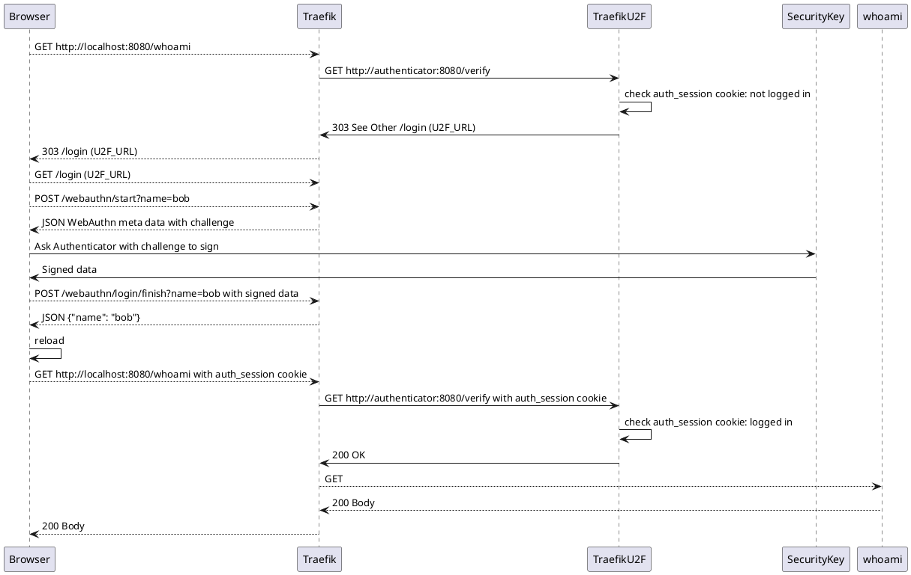

# Traefik-U2F-SSO



## Install

```
go get github.com/Tedyst/Traefik-U2F-SSO
```

## Running

```
go run .
```

This will start the server at port 8080, reachable at [localhost:8080](http://localhost:8080).

## License

MIT.
